# cursor 100%激活1年 -- 《**暂留之策**》

【参考认证文档】CursorPro最新激活一年的方法！

https://docs.qq.com/markdown/DSHNKa3hncWFTZGVR

**2025年5月18日新的解决方案 -- 暂留之策**

备注：激活cn和很多国家被限制了，这几天成功的只能是海外教育邮箱，基本申请成功很快，但是考虑大部分晚来的正经的cn学生是享受不到这次教育优惠，给出下面方案 👇

注册 **硅基流动** 或者其他api平台

​	推荐硅基流动这个是因为我自己用下来感觉不错，很简单，关键是用邀请码注册能白嫖2000万Tokens，而且官方扣的很少，可以给大多同学爽玩

★ 用带有邀请码 （*ZWboIcB3*）的链接注册，官方赠送**2000万Tokens**余额，按量计费也能用挺多次 https://cloud.siliconflow.cn/i/ZWboIcB3 

然后创建对应的key 和 复制 baseURL 到cursor中添加模型，就可以和正常使用cursor一样调用ai了， 同理这api也可接入到你的代码、项目中， 用邀请码注册领取**2000万Tokens**先玩玩，就不用自己充值，有推荐的其他好的平台和方案欢迎QQ群聊讨论~

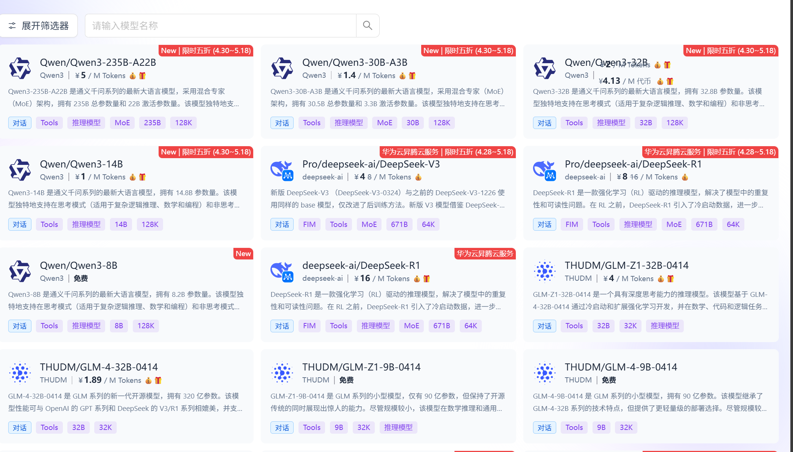

记得**写模型的名字**，然后**点亮它**就能爽玩 2000万Tokens 了

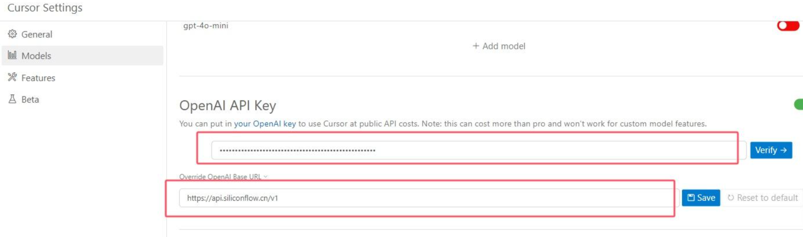

---

注意： 
**2025年5月12日 11点03分**

由于china被限制，现在暂时不使用 edu.cn 的邮箱进行注册。有国外朋友的优先使用国外邮箱进行认证
并且第一批被封的账号这段时间都会收到恢复邮件，这些账号是能正常使用pro的1年教育优惠的。

## 一、中国学校选项激活 - 操作步骤：

把我的js脚本导入到浏览器 油猴（篡改猴中） 按住shift 刷新认证的国家选择的页面，发现可以选择 china 甚至所有的中国学校都能出来了！  包括985

记得启用我的脚本

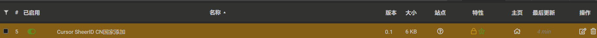

稳定脚本 2025年5月7日 运行效果 ↓

注意重新打开认证界面，看到我的js脚本激活说明成功了，可以选择china

​	如果没有触发就 **关闭浏览器重新打开认证界面**

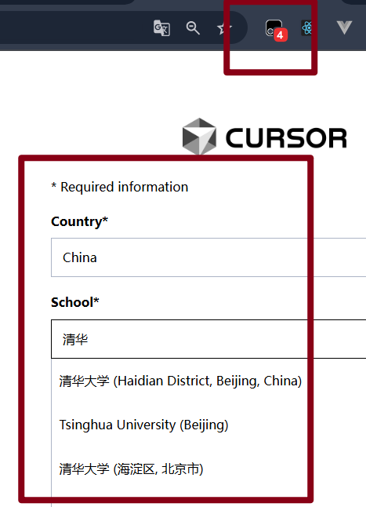

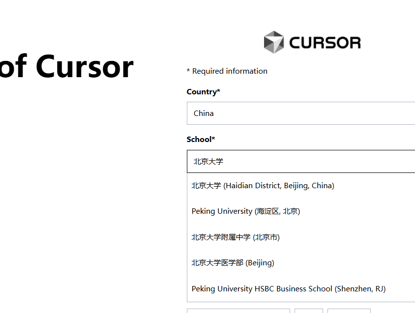

## 二、2025年5月8日 23点51分 100%成功的方法

核心步骤：

### （1）edu.cn学生邮箱认证：

1. 用自己学校的edu邮箱，注册科技云：https://passport.escience.cn/login
2. 用自己学校的edu邮箱，注册cursor：https://www.cursor.com/cn
3. 在此界面提交信息，请结合我的china脚本：https://github.com/DIFFfeng/Cursor-free-student

流程：
科技云注册成功后，会有这个提示：
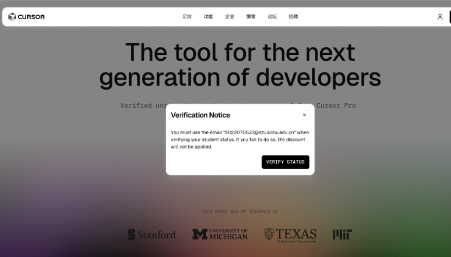

接下来：点verifu status
注意：一定选中国科学院半导体研究所，最下面的邮箱填自己edu邮箱（注：如果自己edu没有收到邮件，那就是被学校吞了；你只能换edu邮箱，要么买要么借：

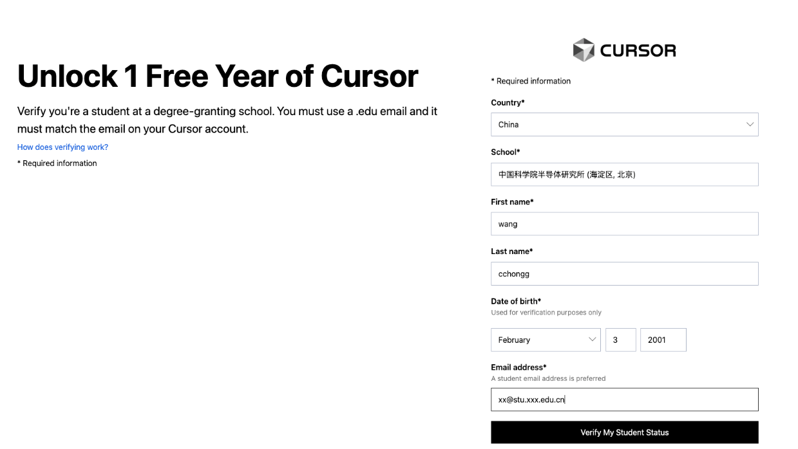

提交。

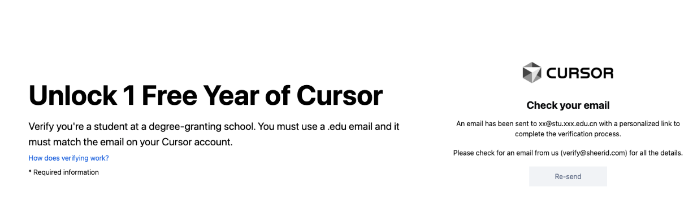

进自己邮箱找一下链接：
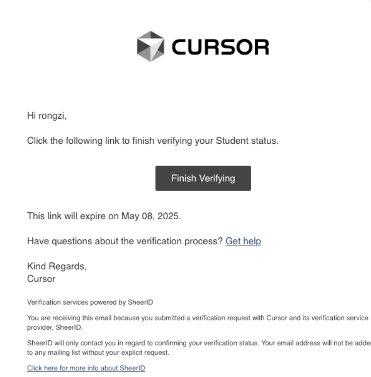

在点击之前，一定要注意！科技云已登陆
接下来按照指示走即可。
点击即可跳转到科技云进行认证：

 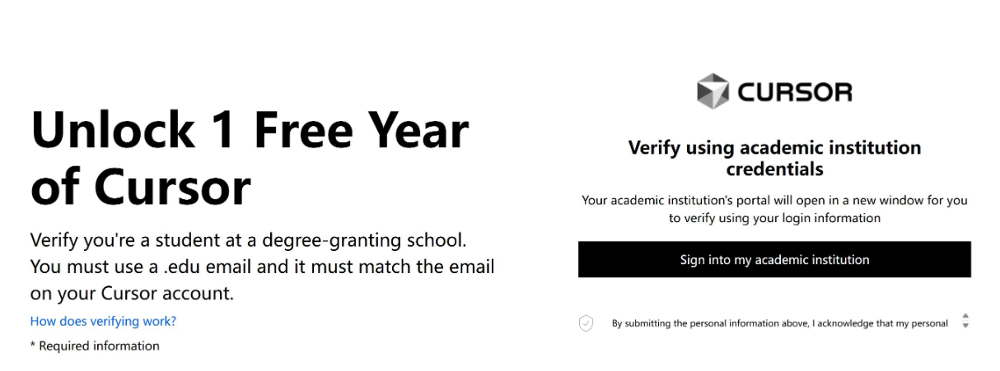

最终成功认证效果：

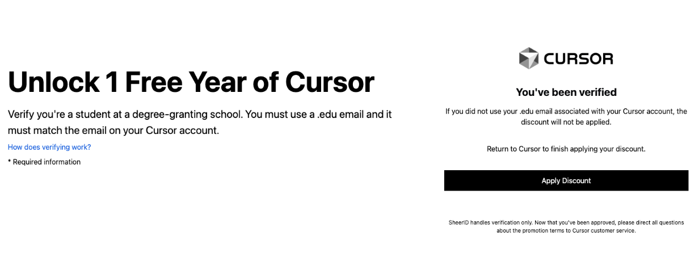

### （2）通过认证后，激活1年pro cursor会员：

1. **看edu邮件：点击apply discount：**

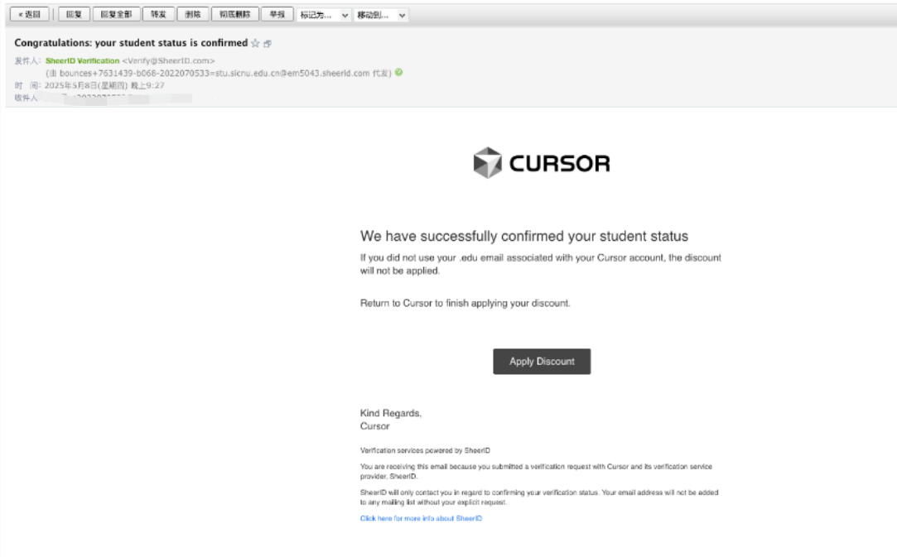

1. 填写支付宝付款信息时，地址全部写满！

出现0元时，才算成功！否则会扣款！记得把“采用每年计费周期开关打开”～（图上为关闭状态）
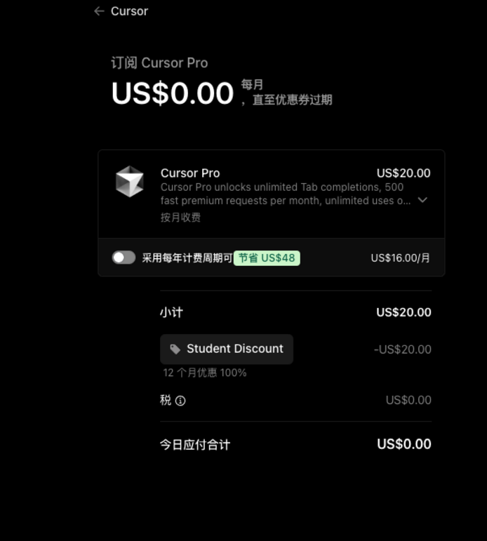
扫码付款（这一步无法继续的，请把网址在手机或ipad打开，更新支付宝，然后扫码提交即可

---

## 三、学生认证其他问题加入qq交流群

群号是 ： ~~811966302~~  ~~915539110~~ 满了  现在只能进入：959156993 

​	（请备注GitHub+id 优先通过）

~~[74662927475](readme.assets/1746629274756.png) 失效群1图片~~

~~[74668560068](readme.assets/1746685600686.png) 又满人了~~

**2025年5月9日 下午起 进新群 👇** 请给我点击右上角 star~

5-9 新群号： 959156993

公众号链接，欢迎点赞： [5月7日晚 CursorPro最新激活一年的方法！稀缺资源，手慢无！](https://mp.weixin.qq.com/s/htpMwxJT73L-hQwJ7ritHA)

## 四、简述操作步骤:

1. 微软教育版邮箱注册： https://go.microsoft.com/fwlink/?linkid=2283200
2. 登陆 Cursor 官网，点击 `VERIFY STATUS` ：https://www.cursor.com/students
3. 用https://github.com/DIFFfeng/Cursor-free-student 脚本拖入到 **'油猴'插件管理页面** 就能刷新出 China 地区
4. 填写个人信息
5. 遇到SheerID验证时填写第一步注册的微软教育邮箱即可
6. 然后几秒后查看教育邮箱的收件箱
7. 注册成功！